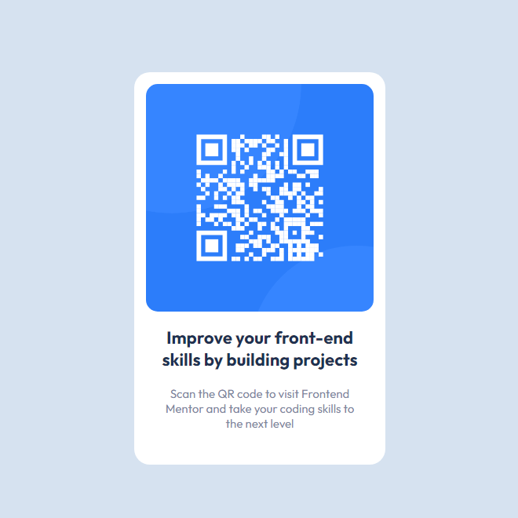

# Projeto QR code component

O exercício tem como objetivo fazer um layout para o componete de QR code.

## Tecnoliga utilizadas

- HTML
- CSS

## FeedBack

- Este projeto foi bem fácil nada que exija muito do desenvolvedor, porém e bom para praticar.
- Espero que vocês deixem um feedback para que eu possa aprimorar meu conhecimento.

#

